# Stripmuren Brussel Routeplanner

**Project repository:**
https://github.com/Ty0906/stripmuren

*Persoonlijke noot:*
    *Ik heb voor deze applicatie gekozen omdat ik de bestaande stripmuren website al zelf heb gebruikt en een werkelijke tour hiervan heb gedaan in Brussel.*
    *Eén van de zaken die ik toen op de bestaande website gemerkt had is dat - ondanks je wel een kaartje hebt met de locatie van de bestaande stripmuren - je zelf je route moet gaan "puzzelen".*
*
    *Het was dan ook een leuke uitdaging om hieraan een oplossing te kunnen bieden met mijn website en de opdracht binnen het vak Advanced Web te kunnen ontwikkelen met een persoonlijke motivatie.*
    *Deze eigen website ga ik dus zelf wel nog gebruiken als we nogmaals een uitje Brussel plannen en we een route langs de stripmuren willen doen.*

## 1. Projectbeschrijving

Stripmuren Brussel Routeplanner is een interactieve (single-page) webapplicatie die gebruikers toelaat om de beroemde stripmuren in Brussel te ontdekken én een route tussen hun favoriete muren te genereren. 
De applicatie haalt de werkelijke data op via de Open Data Brussels API en combineert een lijstweergave met een interactieve kaart (Leaflet).

Gebruikers kunnen:
    - stripmuren bekijken en uitgebreid verkennen in een overzichtelijke kaart- en lijstweergave 
    - zoeken, sorteren en filteren
    - favoriete stripmuren opslaan
    - hun voorkeur (taal, favorieten) bewaren tussen sessies
    - een wandelroute berekenen langs hun favoriete stripmuren

### Functionaliteiten 

- Taal NL/FR: klik op icoontje om de taal van de volledige website te wijzigen 
    voorkeur wordt opgeslagen en duidelijk visueel aangeduid (roze kleur)

- Zichtbaarheid aantal stripmuren: elke keer wordt het aantal stripmuren (ook na filtering/enkel favoriete muren tonen enz) duidelijk getoond

- Zoeken: het inputveld geeft aan dat de ingetypte tekst zal zoeken op titel en tekenaar van de stripmuren (niet hoofdletter gevoelig) en de lijst met resultaten zal geven (alsook het aantal). 
    vb. Geef "steen" in => geeft als resultaat (stripmuur met tekenaar Willy Vandersteen)

    ==> de map toont nu ook enkel de gefilterde resultaten (map kan hierdoor worden uitgezoomd als de stripmuren zich dicht bij elkaar bevinden)

- Sorteren op: dropdown met mogelijkheid om de stripmuren alfabetisch te sorteren op:
    - tekenaar 
    - titel
  Deze sortering kan ook gebruikt worden in combinatie met filtering en favoriete muren

- Toon enkel Favoriete Stripmuren: checkbox die overschakelt naar aangeduide favoriete stripmuren = stripmuren met ❤️ icoontje (aantal ook zichtbaar)

    - de button "bereken route" verschijnt nu ook 'aanklikbaar' indien er minstens 2 favoriete stripmuren werden aangeduid 
    - de map wordt iets vergroot zodat bij een route een duidelijker beeld kan gegeven worden
    - de map toont enkel de favoriete stripmuren met een hart icoontje ipv een tekstballon
    - afvinken van een favoriet zal deze onmiddellijk uit de lijst wegfilteren (aantal wordt ook aangepast)

- Button Bereken Route (bij filtering op favoriete stripmuren): er wordt een wandelroute berekend en getoond op de map + instructies

    - routeinstructies die zichtbaar zijn op de map (je kan volgen waar je zit bij scrollen op de instructie)
    - routeinstructies zijn in de taal van de website (NL of FR)
    opmerking:
    - deze button is niet aanklikbaar zolang favoriete stripmuren niet werd aangevinkt. Bij hover over de knop, krijg je hiervoor de instructie te zien
    - deze button is niet aanklikbaar zolang er minder dan 2 favoriete stripmuren worden aangeduid (je kan geen route berekenen met minder dan 2 punten). Bij hover over de knop, krijg je hiervoor de instructie te zien.

- Button Kaart verbergen / Kaart tonen: zorgt voor weergave van enkel de stripmuurkaarten of standaard weergave van zowel stripmuurkaarten als map met locatie van de stripmuurkaarten (points)

- Map: bevat alle stripmuren die getoond worden onder de map

    - stripmuren worden aangeduid met een tekstballon icoontje
    - favoriete stripmuren worden aangeduid met een ❤️ icoontje
    - je kan deze icoontjes aanklikken en dan krijg je de titel van de stripmuur als pop-up
    - zoomen op de kaart kan met + en - of met scroll van de muis
    - verplaatsen kaartview kan (muis op kaart klikken en verplaatsen)

- Stripmuurkaarten - Foto:
    
    - elke stripmuurkaart heeft een foto
    - hover over de foto om deze groter te zien

- Stripmuurkaarten - Titel:

    - Elke stripmuurkaart heeft een titel
    - hover over de titel en deze wordt groter en gekleurd (wordt roze) getoond (=duidelijk aanklikbaar)
    - Klik op de titel: De pop-up op de map verschijnt zodat je weet waar deze stripmuur zich bevindt

- Stripmuurkaarten - informatie:

    - Elke stripmuurkaart heeft: 
        een Tekenaar (sorteerbaar)
        een Adres (zoekbaar)
        een Gemeente (zoekbaar)

- Stripmuurkaarten - meer info:

    - Elke stripmuurkaart heeft een URL link "meer info"
    - Hover over "meer info" en deze wordt groter en onderlijnd getoond (=duidelijk maken van link/aanklikbaar)
    - klik op "meer info": er wordt een nieuw tabblad geopend naar de juiste stripmuur op de officiële website zodat je alle info hier ook kan nalezen

- Stripmuurkaarten - 🤍 of ❤️ icoontje:

    - Elke stripmuurkaart heeft een 🤍/❤️ icoontje 
    - hover over deze hartjes en deze worden groter getoond (=duidelijk aanklikbaar)
    - kan aangeduid/opgeslagen worden als "favoriet" = ❤️
    - klik 🤍 aan en het icoontje wijzigt naar favoriet = ❤️ icoontje
    - dit wordt ook onmiddellijk op de map gewijzigd naar een ❤️ icoontje ipv tekstballon
    - klik ❤️ aan en het icoontje wijzigt naar favoriet = 🤍 icoontje
    - dit wordt ook onmiddellijk op de map gewijzigd terug naar tekstballon ipv een ❤️ icoontje

## 2. Gebruikte API's met links

Dataset: bruxelles_parcours_bd

Bron: Opendata.brussels.be

URL: https://opendata.brussels.be/api/explore/v2.1/catalog/datasets/bruxelles_parcours_bd/records?limit=-1

Dataset:
- naam van de stripmuur (NL/FR)
- Tekenaar 
- adres (NL/FR)
- gemeente (NL/FR)
- foto/afbeelding
- meer info (externe link naar officiële website)
- Geo-locatie (lat / lon)

## 3. Implementatie van technische vereiste

### 3.1 DOM-manipulatie:

    Selecteren van elementen: 
        - main.js lijnnr 13-25, 104-105, 113-135 (document.getElementById, querySelector, ClassList)
        - render.js lijnnr 87

    Renderen van HTML kaarten: 
        - file render.js: lijnnr 30-35 + 54-94

    Event listeners:
        - main.js lijnnr 265 & 278-279 & 341 & 414 = click events (inklapbare map, taal en favorieten en popup kaart en bereken route)
        - main.js lijnr 283 = input event (zoeken)
        - main.js lijnnr 298 & 309  = change event (sorteren en filteren favorieten)

### 3.2 Modern JavaScript:

    - const:
        gebruikt voor waarden die enkel geinitieerd en niet heringesteld worden
        - api.js lijnnr 5 & 10 & 16 & 17
        - language.js lijnnr 3 & 83 & 85
        - main.js lijnnr 13-44 & & 76 & 95 & 138 & 166 & 216 & 226 & 245 & 284 & 299 & 311 & 343 & 347 & 370 & 395 & 404 & 416 & 419 & 423 & 438 & 466 & 470-471 & 483 & 485 & 489 
        - map.js lijnnr 19-22 & 43

    - let:
        gebruikt voor variabele waarden (worden heringesteld)
        - main.js lijnnr 53-64 & 191-195 & 199-200 & 213-215 & 412 & 418
        - render.js lijnnr 5-49 & 87

    - template literals:
        vooral gebruikt voor HTML structuur dynamisch op te bouwen
        - api.js lijnnr 13 (voor error foutmelding, met literals duidelijker/leesbaarder)
        - main.js lijnnr 44 & 153-154 & 159-160 
        - render.js lijnnr 30-35 & 54-81

    - iteratie over arrays
        door mijn (lijst)items loopen om de UI te renderen
        - main.js lijnnr 73 & 97 (forEach)
        - main.js lijnnr 199 & 215 & 418 (for)
        - render.js lijnnr 90

    - array methodes
        sort en filter functies gebruikt (MDN tutorial)
        - main.js lijnnr 230 & 235 (.sort)
        - main.js lijnnr 56 & 358 & 485 (.filter)

    - arrow functions
        waar duidelijk gebruikt voor events en array methodes
        - main.js lijnnr 56 & 72-73 & 97 & 230 & 235 & 358 & 485 (array methodes)
        - main.js lijnnr 265 & 278-279 & 283 & 298 & 309 & 414 (events)

    - conditional (ternary) operator 
        moderne if..else gebruikt bij condities met 1 lijn code als resultaat voor leesbaarheid - zie ook functie updateStatus in main.js lijnnr 148, updateRouteButton in main lijnnr. 164 en updateToggleMapText in main.js lijnnr 244
        - language.js lijnner 85 & 102-116
        - main.js lijnnr 109-110 & 152-154 & 158-160 & 171-173 & 177-179 & 183-185 & 200 & 148-250 & 252-254 & 366 & 428-430 
        - map.js lijnnr 19 & 22 & 27-29
        - render.js lijnnr 9 & 13 & 17 & 21 & 36-45 & 49

    - Callback functions 
        Event listeners gebruiken callbacks omdat code pas uitgevoerd wordt wanneer event plaatsvindt
        - main.js lijnnr 278-279 (callback = () => switchLanguage("NL") of ("FR"), wordt doorgegeven aan addEventListener)
        - main.js lijnnr 283 & 298 & 309 & 304 & 414 (callback = () => {...})
        - main.js lijnnr 56 & 358 & 485 (filter callbacks: filter roept mijn functie aan om te beslissen welke elementen blijven)
        - main.js lijnnr 73 & 97
        (forEach callbacks =(entry => ... en img => ..) : forEach voert mijn functie uit voor elk element )
        

    - async/await/promises
        - api.js async function fetchMurals() 
        - main.js lijnnr 480-509 async function loadMurals() met try/catch 

    - Observer API
        - main.js lijnnr 64-99 IntersectionObserver (lazy image loading)

    - Local Storage
        - main.js lijnnr 51-59 & 103 & 364 (favoriteMurals & PreferredLanguage)

### 3.3 Data & API:

    - Fetch API: api.js lijnnr 10 fetch(API_URL)

    - JSON :
        - main.js lijnnr 55 JSON.parse (omzetten string naar JS object (array))
        tussendoor ongeldige id's wegfilteren 
        - main.js lijnnr 57 JSON.stringify (omzetten array naar string om propere data opnieuw opslaan (localStorage))

### 3.4 Opslag en validatie

    - Formulier validatie (main.js)

        - validatie data uit LocalStorage - valideert of elke id bestaat:
            favoriteMurals = favoriteMurals.filter(id => id && id !== "undefined" && id !== "null");
        - validatie van minstens 2 punten zodat route kan berekend worden (je kan geen route hebben met minder dan 2 punten, dit zou crash geven):
              if (points.length < 2) { alert(currentLang === "NL" 
                ? "Je moet minstens 2 favoriete stripmuren hebben om een route te berekenen!"
                : "Vous devez avoir au mons 2 fresques favorites pour calculer un itinéraire!");
              return; }

    - Local Storage (main.js)

        - opslag van favoriete stripmuren: 
            favoriete stripmuren worden ingelezen (indien leeg wordt lege array voorzien)
                let favoriteMurals = JSON.parse(localStorage.getItem('favoriteMurals')) || [];
            data wordt opgeschoond door filter:
                favoriteMurals = favoriteMurals.filter(id => id && id !== "undefined" && id !== "null");
            correcte data wordt terug bewaard als string (stringify) en terug naar localStorage gezet (setItem) 
                localStorage.setItem('favoriteMurals', JSON.stringify(favoriteMurals));
        
        - opslag van voorkeurstaal:
            voorkeurstaal wordt gelezen:
                let currentLang = localStorage.getItem("preferredLanguage") || "NL";
            voorkeurstaal wordt gezet bij clickevent die functie switchLanguage(lang) uitvoert:
                function switchLanguage(lang) {
                 currentLang = lang;
                 localStorage.setItem("preferredLanguage", lang);

### 3.5 Styling:

    - basis HTML layout
        index.html: basis structuur header (met inhoud), main (zonder inhoud) 
        render.js: bevat de main inhoud= mural cards: lijnnr 54-98

    - CSS basis
        zie style.css: alle basis stijl elementen gebruikt zoals background, border, font, ..

    - Gebruiksvriendelijke elementen (verwijderknoppen, icoontjes,..)

        Button "Toon kaart/verberg kaart" geeft je de mogelijkheid om gebruiksvriendelijk door alle kaarten te scrollen zonder dat de kaart "in de weg" staat (index.html lijnnr 61-63)
            style.css lijnnr 176-208 & 532-551 

        checkbox "toon enkel favoriete muren" (index.html lijnnr 54-55)
            style.css lijnnr 107-144 & 162-168 & 417-422 & 492-501 & 508-513

        button "bereken route" (enkel aanklikbaar bij check favoriete muren (min 2)=true (zie main.js lijnnr 309-336 & 341-390 en function updateRouteButton() lijnnr 164-187 ))
            style.css lijnnr 92-104 & 503

        aanklikbaar icoontje (❤️) voor aanduiden favoriete stripmuur (render.js lijnnr 76-78 )
            style.css lijnnr 345-356

        buttons voor taal NL/FR (index.html lijnnr 20-23)
            style.css lijnnr 39-57 & 449-452

        dropdown voor sorteren op titel, tekenaar (index.html lijnnr 39-45)
            style.css lijnnr 65-90

    - Responsive design
        style.css bestaat uit volgende delen:
            - MOBILE FIRST (start lijnnr 23) voor kleine schermen tot 700px
            - TABLET (start lijnnr 390) voor schermen van 701px tot 1099px
            - DESKTOP (start lijnnr 436) voor desktop (vanaf 1100px)

### 3.6 Tooling & structuur:

    - Project is opgezet met Vite
        project aangemaakt met npm create vite@latest

    - Correcte folderstructuur
        scheiding tussen HTML, CSS, JS (met verschillende js files voor duidelijkheid)
        stripmuren
            public
                bevat de gebruikte svg 
            screenshots
                bevat de screenshots (hoofdstuk 5)
            src
                api.js (fetch muren)
                language.js (vertaling map-instructies)
                main.js (main file met logica en events)
                map.js (kaart + markers)
                render.js (renderen van stripmuurkaarten)
                style.css (styling)
            index.html

## 4. Installatiehandleiding

### Vereisten
  - Node.js 
  - npm

### Stappen
1. Clone repository:
    git clone https://github.com/Ty0906/stripmuren.git
2. Juiste map selecteren:
    cd stripmuren
3. Dependencies:
    npm install
4. Dev server:
    npm run dev
5. Open applicatie in de browser:
    http://localhost:5173 

## 5. Screenshots van de applicatie

- Algemene screenshot Stripmuren Brussel Routeplanner
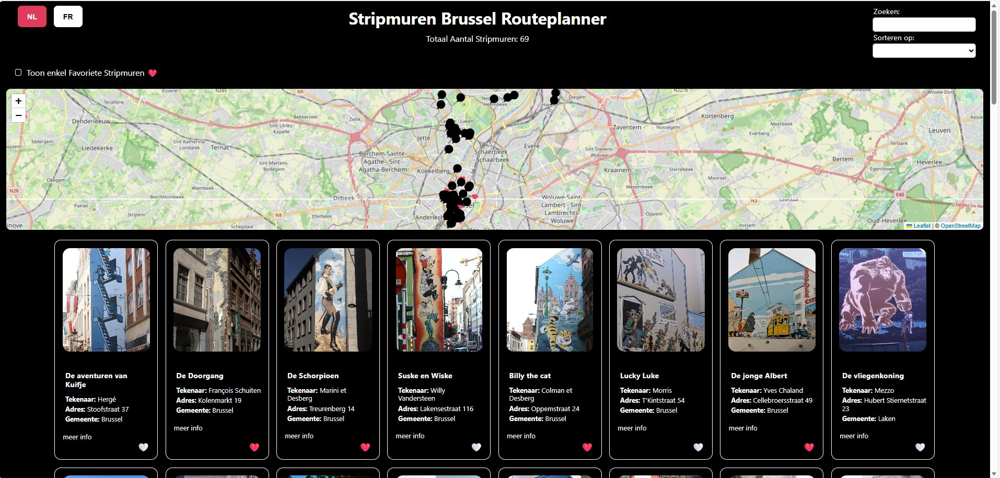

- Tablet/phone screenshot
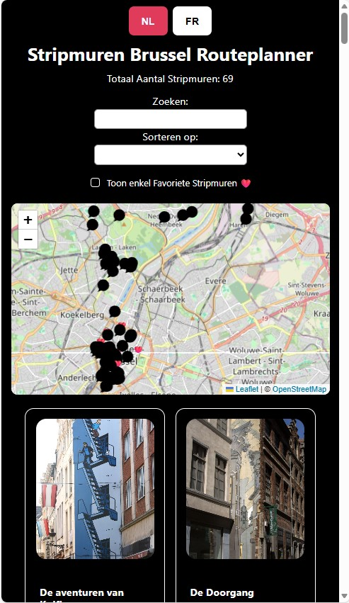

- Button Kaart verbergen : overzichtelijke weergave van alle stripmuurkaarten
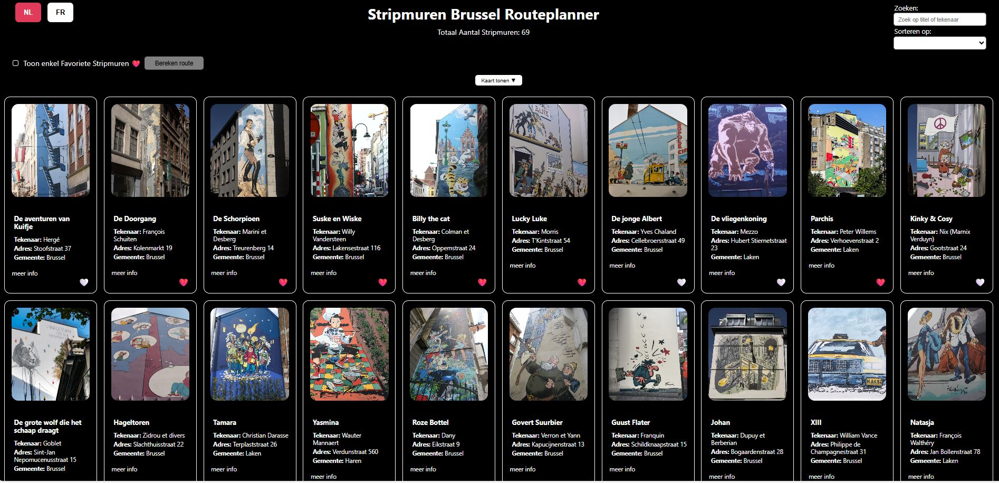

- Button Kaart tonen: terug zichtbaar maken van de kaart (zie Algemene screenshot)

- Taal NL/FR: klik op icoontje om de taal van de volledige website te wijzigen (voorkeur wordt opgeslagen)
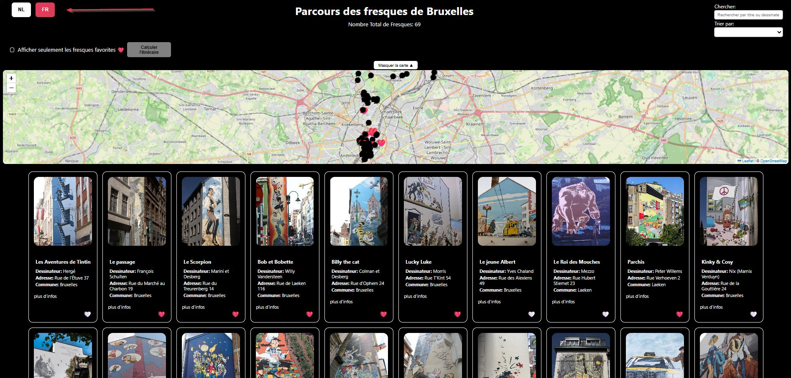

- Zoeken: het inputveld geeft aan dat de ingetypte tekst zal zoeken op titel en tekenaar van de stripmuren (niet hoofdletter gevoelig) en de lijst met resultaten zal geven (alsook het aantal). 
    vb. Geef "steen" in => geeft als resultaat (stripmuur met tekenaar Willy Vandersteen)
    ==> de map toont nu ook enkel de gefilterde resultaten (map kan hierdoor worden uitgezoomd als de stripmuren zich dicht bij elkaar bevinden)
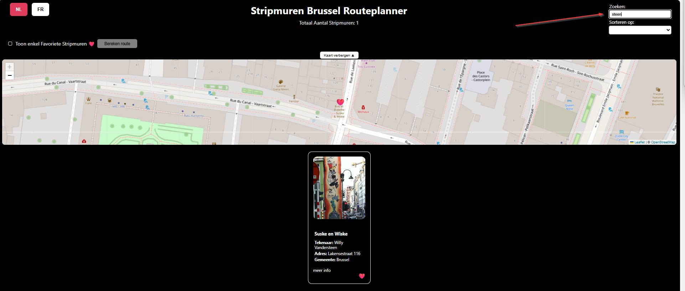

- Sorteren op: dropdown met mogelijkheid om de stripmuren alfabetisch te sorteren op:
    tekenaar of titel
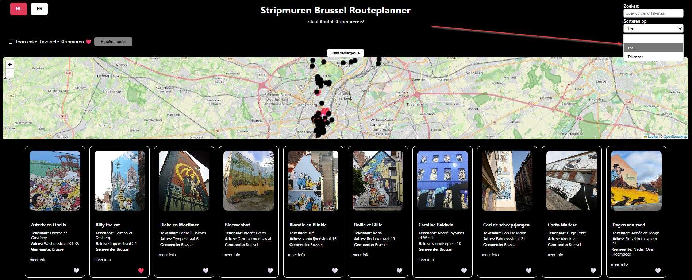

- Toon enkel Favoriete Stripmuren: checkbox die overschakelt naar aangeduide favoriete stripmuren = stripmuren met ❤️ icoontje (aantal ook zichtbaar)
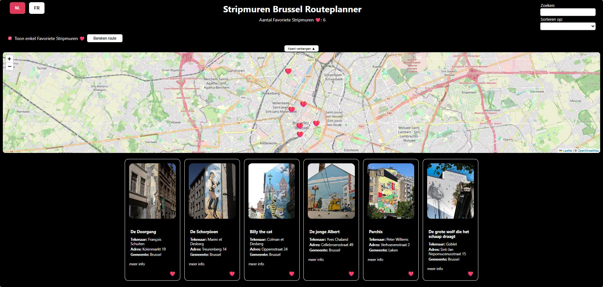

- Button Bereken Route (bij filtering op favoriete stripmuren): er wordt een wandelroute berekend en getoond op de map + instructies
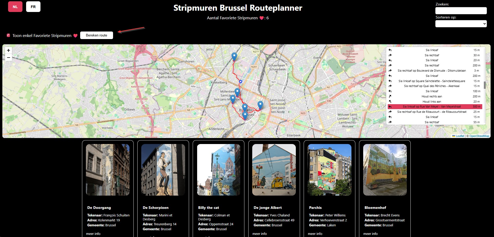

- Instructies bij Button Bereken Route
    - niet aanklikbaar zolang favoriete stripmuren niet werd aangevinkt: instructie wordt getoond 
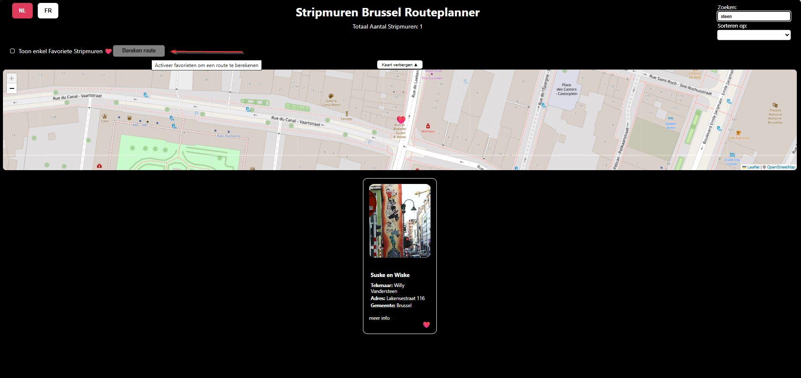
    - niet aanklikbaar zolang er minder dan 2 favoriete stripmuren worden aangeduid: instructie wordt getoond 
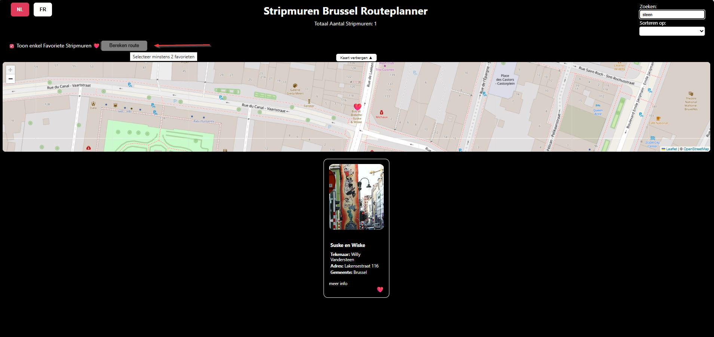

- Map: bevat alle stripmuren die getoond worden onder de map
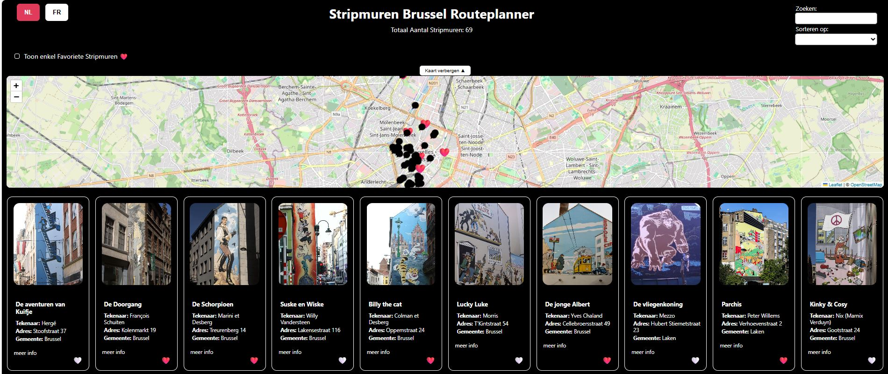

- Map: klik op point geeft info
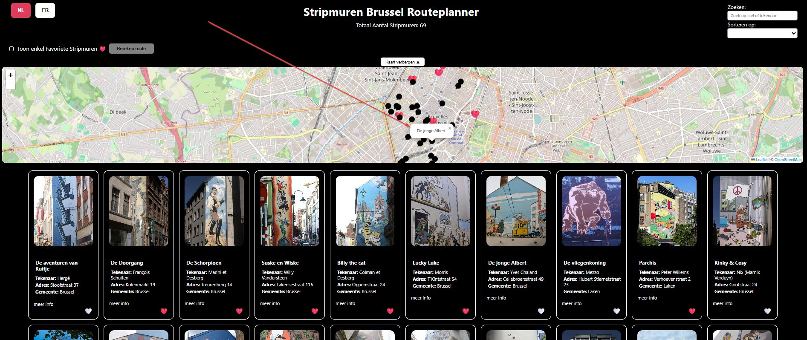
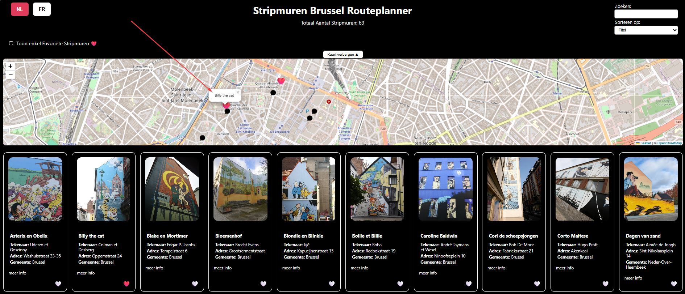

- Stripmuurkaarten - Foto hover:
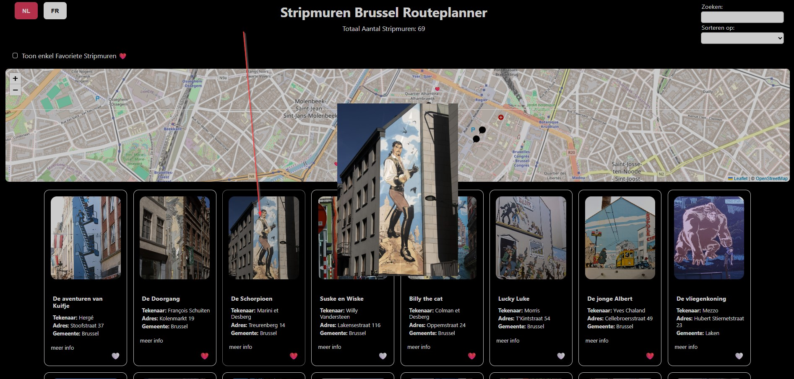

- Stripmuurkaarten - Titel hover + popup op kaart:
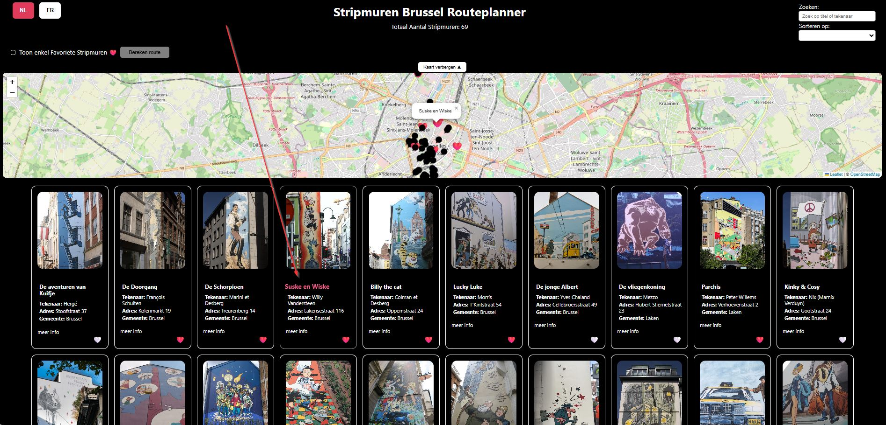

- Stripmuurkaarten - meer info:
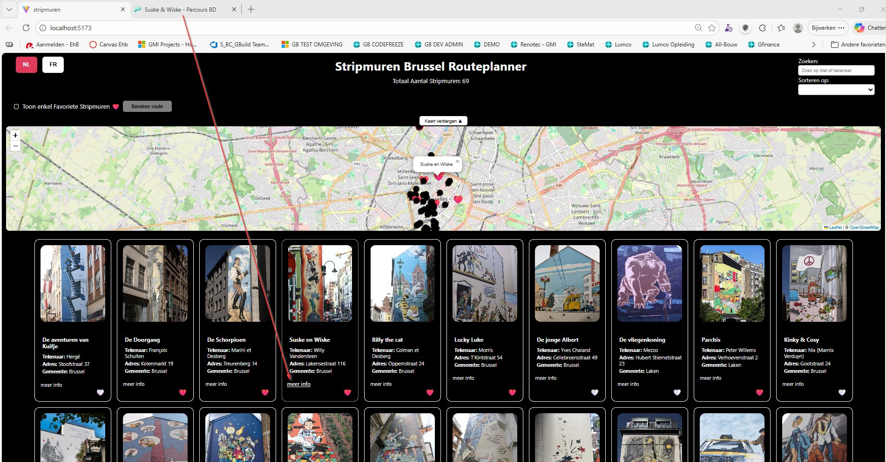

- Stripmuurkaarten - 🤍 of ❤️ icoontje:
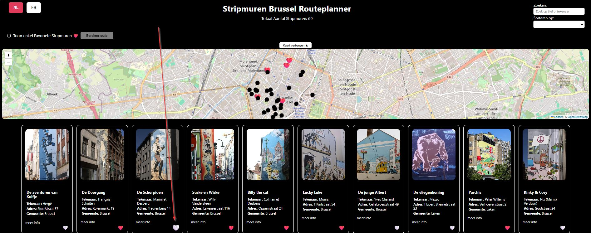

## 6. Gebruikte bronnen

- Open Data Brussels API

- Documentatie uit de Canvas modules Web Advanced en Web Basic

- MDN (topic: Array)

- Leaflet en Leaflet Routing Machine sites: Quick Start + Documentation + GitHub

- Cartoon Bubble by Samy Menai from "https://thenounproject.com/browse/icons/term/cartoon-bubble/" title="Cartoon Bubble Icons" Noun Project (CC BY 3.0) => zie icon.svg

- comic talk by Andy Horvath from "https://thenounproject.com/browse/icons/term/comic-talk/" title="comic talk Icons" Noun Project (CC BY 3.0) => zie lazy.svg

### AI chatlog

00. Grid layout hulp gevraagd vooraf (nog geen account toen) zie zondag 8 maart 2026 wijzigingen in Git (deze chat heb ik jammergenoeg niet opgeslagen) - maar deze heb ik zelf teruggedraaid omdat mijn eigen idee toch leuker was tov het overnemen van Grid layout (Grid layout hebben we niet gezien in cursus Web Basic, enkel flex) - zie post 9. 
0. Ik had de tekst van mijn chat wel gekopieerd naar een bestand. Toen gevraagd en account aanmaken was juiste oplossing. Om volledig te zijn, voeg ik wel het word bestand toe van vooraf gevraagde hulp (zie AI chatlog.docx rechtstreeks in folder stripmuren). Deze bevat:
    - vraag over style.css die error gaf zolang ik nog met live server werkte (pag1)
    - vraag over bijkomende file waarbij ik export was vergeten (pag 3)
    - vraag over hartjes icoon (hoe dit gebruiken) (pag 5)
    - vraag over icoon dat niet aanklikbaar was (oplossing met closest) (pag 7)
    - vraag over flikkering van mijn foto's (oplossing = geen volledige re-render doen maar enkel hartjes updaten) (pag 11)
1. Leaflet: basis opstelling: https://chatgpt.com/share/69b26476-1d48-800e-8cb1-ce34506716d3
    - geen resultaat: hulp gevraagd: lon/lat omgedraaid
    - geen resultaat: hulp gevraagd: icon was 0px = toegevoegd in css
    - gevraagd naar mogelijkheid om markers terug te resetten: LayerGroup toegevoegd
    - tip fitBounds toegevoegd
2. Leaflet: leaflet popup bij event (gekozen voor click): https://chatgpt.com/share/69b2eb14-8b9c-800e-a1e5-ddcca6ad0cdb
    - navraag hover event voor op map te tonen - gekozen voor toevoegen aan click
    - hulp voor id ophalen tov marker leaflet
3. Leaflet Routing Machine: https://chatgpt.com/share/69b43350-2b00-800e-ac10-ab6da021aaf3
    - navraag trage response: defer toegevoegd aan scripts
    - routing control toegevoegd om tragere kaart te vermijden
    - kortste route opties: standaard opties optimizeWaypoints: true en recorderWaypoints: true toegevoegd
    - routekaart automatisch laten inzoomen op route: fitBounds toegevoegd
    - tweede kaart aangemaakt maar dit zorgde voor geen Bounds meer 
        (oorzaak kaart nog niet opgebouwd, display none tot aan actie 'bereken route'):       
            invalidateSize met Timeout toegevoegd zodat fitBounds weer goedkwam
    - fitBounds werkende gekregen op Leaflet kaart: featureGroup() ipv layerGroup()  
4. Leaflet Routing Machine: https://chatgpt.com/share/69bd6b48-da68-800e-a723-a77ff05ac280
    - navraag classes/id's van LRM voor css verbetering: tekst van instructiepaneel was wit op witte achtergrond
    - navraag mogelijkheid vertalen naar NL: 
        na veel opzoekwerk (en verkeerde info van chat over localization) gevonden dat localization.js niet meer wordt gebruikt: (hier gevonden: [src/localization.js](https://github.com/perliedman/leaflet-routing-machine/blob/master/src/localization.js))
        ==> samen met chatgpt dan maar eigen formatter gemaakt met NL vertalingen gebaseerd op localization.js
5. Sortering toegevoegd: https://chatgpt.com/share/69c2aaa3-83f4-800e-a327-ffd7f6caf57c 
    - array sort op MDN gevonden - deze toegepast en dan laten checken 
    - suggesties voor localCompare gebruik gekregen - opgezocht op MDN en overgenomen van MDN, daarna laten checken
    - kleine verbetersuggesties overgenomen (opties bij localCompare toegevoegd & conditie gewijzigd
    - suggestie: array = [... array] toegepast voor bugs te voorkomen - navraag gedaan waarom dit beter is
6. NL - FR toegevoegd: https://chatgpt.com/share/69c66a54-0510-838b-a98c-90585ce449a9
    - hulp bij foutmelding gevraagd (bleek typo te zijn)
    - suggesties voor codevermindering gevolgd
7. Leaflet Routing Machine: https://chatgpt.com/share/69c69b88-ee2c-8387-bbfe-20a03f34b001
    - navraag waarom sommige instructies nog niet werden vertaald en gecorrigeerd
    - copy/paste van de FR vertalingsinstructies die ik vroeg om ook aan te maken 
    (zie ook uitleg hierboven nr. 4 waarom eigen vertalingen nodig bleken)
8. Hulp checkbox styling css: https://chatgpt.com/share/69c6bcc5-abdc-8333-b9e2-cbb2070064b3
    - lelijke blauwe box vervangen door suggestie van chatGPT
9. CSS hulp: https://chatgpt.com/share/69c7dcde-8d00-8329-8aac-0890ae3dcb78 
    - eerst zelf grid teruggedraaid naar mijn eigen flex (zie post 0)
    - sticky - fixed probs met header en kaart opgelost
10. CSS hulp: https://chatgpt.com/share/69c8f066-d1b0-8328-b479-bd971f0dbd98
    - kleur hartje proberen te evenaren en toepassen in css
11. LazyImage Observer: https://chatgpt.com/share/69c8fe0d-37d0-8387-a20c-07e2a29b984e
    - vooral cursus gevolgd maar vraag gesteld over hoe ik dit kon zien (mijn vermoeden: achtergrond = correct = kleine css aanpassing gedaan)
12. LazyImage Observer: https://chatgpt.com/share/69c91f9e-ed78-8331-be13-73f93145382d
    - nog een fout met de taal, bleek een lazyObserver vergeten te hebben (zelf gevonden nadat ik al taal had aangepast en niet bleek te werken)
13. Onderdrukken warning: https://chatgpt.com/share/69de1bb9-b830-8333-a29d-c38b91e05b49
    - OSRM gebruikt een demo server en geeft daarover telkens een warning in de F12: 
        besproken met docent: vermelden was ok/alert ook - hier toch gezorgd dat dit opgevangen werd
14. LazyImage Observer: https://chatgpt.com/share/69de2bf2-1278-8330-84d1-74766ff8936f 
    - ik kreeg telkens een unchecked runtime.lastError, na onderzoek bleek dat deze werd getriggered bij taalswitch. 
    - hulp gevraagd of hier iets kon aan gedaan worden, bleek dat de observer door de volledige re-render de boosdoener was
    - init observer afgesplitst van werkelijk laden lazyImage 

